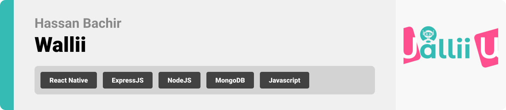

<br><br>

<!-- project philosophy -->


> The project philosophy is centered around developing a mobile app that integrates OpenAI technology to enhance the financial well-being of users.
>
> This app aims to make it simple and convenient for individuals to manage their finances, empowering them to make informed decisions with the assistance of AI-based financial advisors. Ultimately, the goal is to help users achieve better financial outcomes without sacrificing the convenience and ease of use they have come to expect from modern mobile applications.

### User Stories

-   As a user, I want to be able to sign up with my own credentials, so that I can create a personalized account on the platform and access its features.
-   As a user, I want to be able to login with my own credentials, so that I can easily access the platform and utilize its features.
-   As a user, I want to be able to create multiple wallets, so that I can segregate my business finances from my personal finances, and have better control over my finances.
-   As a user, I want the option to select an AI-powered financial advisor to help me make informed financial decisions, so that my overall financial health improves.
-   As a user, I want to be able to specify my recurring expenses and incomes, so that I don't have to manually input them every time they occur.
-   As a user, I want to be able to categorize each expense or income record that I insert into the system, so that I can have a better understanding of my financial transactions and make more informed financial decisions.
-   As a user, I want to be able to add financial goals to my financial profile, so that I can receive personalized financial advice from the AI advisor that takes into account my long-term financial objectives.
-   As a user, I want to be able to add budgets to my financial profile, so that I can receive personalized financial advice from the AI advisor that takes into account my spending habits and financial goals.
-   As a user, I want to be able to access an AI-based financial advisor each time I record an expense in a wallet. The AI advisor should take all my financial data as input, including my chosen AI advisor for the AI to impersonate, and output an optimal decision on whether the expense is a good or bad financial decision. This will help me to make informed financial decisions and avoid overspending or making poor financial choices.
-   As a user, I want to be able to track my incomes and expenses by date, so that I can have a clear picture of my financial transactions on any given day.
- As an admin, I want to be able to view a list of all users, so I can effectively manage and monitor the user base.
- As an admin, I want to be able to delete a user's account, so that I can maintain the integrity and safety of the platform by removing inappropriate or fraudulent users.
- As an admin, I want to be able to update user information, so that I can assist users in case they need help with updating their account details or resolving any account issues.
- As an admin, I want to be able to assign admin privileges to other users, so that I can delegate administrative tasks and ensure a smooth operation of the platform.
<br><br>

<!-- Prototyping -->


> We designed Wallii using wireframes and mockups, iterating on the design until we reached the ideal layout for easy navigation and a seamless user experience.

### Wireframes

| Welcome screen                              | Advisor screen                              | SignUp screen                               |
| ------------------------------------------- | ------------------------------------------- | ------------------------------------------- |
|  |  |  |

| Login screen                              | Wallets Screen                            | transaction Screen                       |
| ----------------------------------------- | ----------------------------------------- | ---------------------------------------- |
|  |  |  |

<br><br>

<!-- Implementation -->


> Using the wireframes and mockups as a guide, we implemented the Wallii app with the following features:

### User Screens (Mobile)

| Welcome screen                              | Advisor screen                         | Register screen                          | Login screen                          |
| ----------------------------------------- | --------------------------------------- | --------------------------------------- | --------------------------------------- |
|  |  |  |  |
| Home screen                               | Wallet Screen                             | Update Screen                            | Expense Screen                         |
|  |  |  |  |
| Advisor screen                               | Advisor Screen                             | Calender Screen                            | Calender Screen                         |
|  |  |  |  |
| Budget screen                               | Goals Screen                             | Admin Screen                            | Wallet settings Screen                         |
|  |  |  |  |

### Admin Screens (Web)

| Login screen                            | Register screen                       | Landing screen                        |
| --------------------------------------- | ------------------------------------- | ------------------------------------- |
|  |  |  |
| Home screen                             | Menu Screen                           | Order Screen                          |
|  |  |  |

<br><br>

<!-- Tech stack -->


### Coffee Express is built using the following technologies:

-   This project uses the [Flutter app development framework](https://flutter.dev/). Flutter is a cross-platform hybrid app development platform which allows us to use a single codebase for apps on mobile, desktop, and the web.
-   For persistent storage (database), the app uses the [Hive](https://hivedb.dev/) package which allows the app to create a custom storage schema and save it to a local database.
-   To send local push notifications, the app uses the [flutter_local_notifications](https://pub.dev/packages/flutter_local_notifications) package which supports Android, iOS, and macOS.
    -   🚨 Currently, notifications aren't working on macOS. This is a known issue that we are working to resolve!
-   The app uses the font ["Work Sans"](https://fonts.google.com/specimen/Work+Sans) as its main font, and the design of the app adheres to the material design guidelines.

<br><br>

<!-- How to run -->


> To set up Coffee Express locally, follow these steps:

### Prerequisites

This is an example of how to list things you need to use the software and how to install them.

-   npm
    ```sh
    npm install npm@latest -g
    ```

### Installation

_Below is an example of how you can instruct your audience on installing and setting up your app. This template doesn't rely on any external dependencies or services._

1. Get a free API Key at [https://example.com](https://example.com)
2. Clone the repo
    ```sh
    git clone https://github.com/your_username_/Project-Name.git
    ```
3. Install NPM packages
    ```sh
    npm install
    ```
4. Enter your API in `config.js`
    ```js
    const API_KEY = "ENTER YOUR API";
    ```

Now, you should be able to run Coffee Express locally and explore its features.
